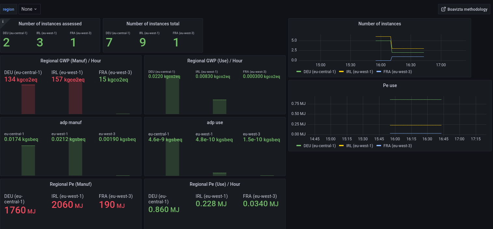

# cloud-scanner-prom-config

A basic prometheus config to scrape metrics from Boavizta Cloud scanner when deployed as a serverless application.

See  [GitHub - Boavizta/cloud-scanner: 📡 Get Boavizta impact data for your aws cloud account usage.](https://github.com/Boavizta/cloud-scanner/).



## Usage

Copy `prometheus.template.yml` into `prometheus.yml`

- update prometheus.yml with cloud scanner URL(s)
- update the remote write configuration if you need to send metrics to a second prometheus instance. This remote write configuration is only needed if this prometheus instance is not publicly accessible from Grafana (like when using a SAAS grafana.com dashboard that relies on a SAAS prometheus as datasource that does not support metric scrapping configuration).

```sh
./start-prometheus.sh
# Will execute:
# docker run --rm -it -p 9090:9090 -v $(pwd)/prometheus.yml:/etc/prometheus/prometheus.yml prom/prometheus
```

Access prometheus UI at: <http://localhost:9090/>

Import the template dashboard to your Grafana instance(`grafana-dashboard.template.json`). You may have to adapt the datasource in Grafana.

## About

The prometheus config  template defines 3 scraping configs to scrapes a single endpoint (a single serverless function) using different parameter (targe regions) values.
